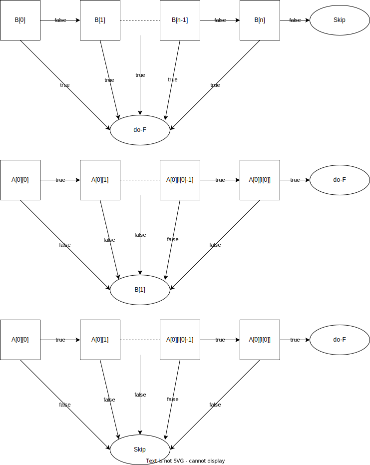

# 短路逻辑四元式生成思路以及反填思路

短路逻辑是逻辑表达式优化里常用方式之一。这里假设运算优先级都是以 C 语言为标准，描述语言是 C++。

考虑如下代码：

```
if (A && B || C) {
    do-F
}
```

以上伪代码展示了当条件 `A && B || C` 被满足时，就做 `F` 的逻辑。

在短路逻辑的考量里，`A && B` 中，如果有一个条件不被满足，那么该表达式的结果为 `false`。相应的，`C || D` 中，如果有一个条件被满足了，那么该表达式的结果为 `true`。

结果便可能会出现如下形式的伪汇编：

```
    test A, A
    jz .L1      ; A 为 false 按照 && 的逻辑，一个为假，结果为假
                ; 跳转到检查 C
    test B, B
    jnz .L2     ; 到了这一句，隐含着 A 为 true，此时如果 B 为 true，
                ; 按照 && 的逻辑，A && B 为真。
                ; 按照 || 的逻辑，有一个为真，结果为真，跳转到执行。
.L1
    test C, C
    jz .L3      ; 到了这一句，隐含着 A && B 为假，此时如果 C 为 false
                ; 按照 || 的逻辑，结果为假，跳转到退出
.L2
    do-F
.L3
```

这样简短的表达式还不能看出所有的特征，所以在一定情况下，将其推广。

```
expr        :   // something
            ;
and_expr    : ( expr        '&&' )* expr
            ;
or_expr     : ( and_expr    '||' )* and_expr
            ;
```

以上是不带括号的逻辑表达式的简单文法。这样的文法会生成如下表达式：

```
A[0][0] && A[0][1] && ... && A[0][l[0]] || A[1][0] && A[1][1] && ... A[1]][l[1]] || ... || A[n][0] && A[n][1] && ... A[n][l[n]]
```

其中每组与表达式长度为数组 `l[0], l[1], ... , l[n]`。

记：

```
B[0] = A[0][0] && A[0][1] && ... && A[0][l[0]]
B[1] = A[1][0] && A[1][1] && ... && A[1][l[1]]
...
B[n] = A[n][0] && A[n][1] && ... && A[n][l[n]]
```

那么对于如下表达式：

```
if (B[0] || B[1] || ... || B[n]) {
    do-F
}
```

按照短路逻辑的思路，可以绘制出如下图像：



其中，最上方表示或逻辑的思路，中间表示有下一个或逻辑时候的与逻辑的思路，最下方表示没有下一个或逻辑时候的与逻辑的思路。

可以看出与逻辑有一种特殊情况的存在。

对应生成的伪汇编思路就是：

最上方：

```
    test B[i], B[i] ; 0 <= i < n
    jnz .do-F
```

```
    test B[n], B[n]
    jz .skip
```

中间：

```
    test A[i][j], A[i][j] ; 0 <= j < l[i]
    jz .next_or
```

```
    test A[i][l[i]], A[i][l[i]]
    jnz .do-F
```

最下方：

```
    test A[i][j], A[i][j] ; 0 <= j < l[i]
    jz .skip
```

```
    test A[i][l[i]], A[i][l[i]]
    jnz .do-F
```

按照如上的思路，制定翻译方案：

```
expr        : { get_result() } // something
            ;
and_expr    : ( expr        { gen_and(); }  '&&' )+ expr
            | expr
            ;
or_expr     : ( and_expr    { gen_or_1(); } '||' )* and_expr { gen_or_2(); }
            ;
```

其中，`get_result()` 用于获取表达式的结果值，`gen_and()` 用于生成与逻辑跳转，`gen_or_1()` 和 `gen_or_2()` 生成或逻辑跳转。

接下来详细介绍一下一个与逻辑跳转生成函数和两个或逻辑跳转生成函数。

``` cpp
void gen_and() {
    auto result = semi_stk.top();   // 从语义栈上获取表达式的结果
    semi_stk.pop();                 // 语义栈将内容弹出
    auto index = gen_jz(result);    // 利用 result 生成跳转，跳转为 jz
                                    // 并记录下四元式的位置
    recorder.push(index);           // 记录生成的四元式的位置
}
```

``` cpp
void gen_or_1() {
    auto result = semi_stk.top();   // 从语义栈上获取表达式的结果
    semi_stk.pop();                 // 语义栈将内容弹出
    auto index = gen_jnz(result);   // 利用 result 生成跳转，跳转为 jnz
                                    // 并记录下四元式的位置
    recorder.push(index);           // 记录生成的四元式的位置

    auto l_index = gen_label();     // 生成跳转标签，用于被 false-and 跳转
    or_label_recorder.push(l_index);// 记录生成的四元式的位置
}
```

``` cpp
void gen_or_2() {
    auto result = semi_stk.top();   // 从语义栈上获取表达式的结果
    semi_stk.pop();                 // 语义栈将内容弹出
    auto index = gen_jz(result);    // 利用 result 生成跳转，跳转为 jz
                                    // 并记录下四元式的位置
    recorder.push(index);           // 记录生成的四元式的位置
}
```

以上的翻译方案中有许多隐含的未展露的细节，这里做一下说明：

- recorder 看作是一个二维数组。每一组与表达式的跳转四元式位置按照顺序构成一维数组，并按顺序保存到二维数组中。
    - 细节实现上，使用栈数据结构 `gen_and()` 中将内容插入到 `recorder.top()` 中。`gen_or_1()` 中先与 `gen_and()` 一样插入，然后建立新的一个数组用于存储下一个与表达式。
    - `gen_or_2()` 与 `gen_and()` 一样插入，不需要建立新的数组。
- 标签数组也是使用栈存储。
- 为了解决 `if` 嵌套问题，具体实现上，`recorder` 的基础是一个三层的栈，第一层用于 `if` 嵌套。这里看作当前 `if` 的栈。

在 `if` 语句反填中，使用如下的文法以及翻译方案：

```
statement   : 'if' { meet_if(); } '(' condition ')' { fill_if(); } statement { end_if(); }
            | 'if' { meet_if(); } '(' condition ')' { fill_if(); } statement { else_if(); } KWelse statement { end_if(); }
            ;
condition   : or_expr
            ;
```

在 `meet_if()` 中，压栈，用于处理嵌套问题。

在 `fill_if()` 中，检查与表达式数量

- 如果是一个，那么按照特殊情况反填
- 如果是多余一个，也即有或分割，按照正常情况反填。同时可以观察到，栈顶的与表达式，也即最后一个与表达式的反填方式和特殊情况一样。所以实际应用中是可以将其合并的。

这并没有做完所有工作，还需要记录一个条件为 `false` 时候的跳转终点的位置，使用栈记录，并在这个时候反填到四元式中。

在 `end_if()` 中，使用记录跳转终点的栈顶元素作为位置生成标签。

在 `else_if()` 中，需要多生成一个 `jmp` 跳转直接跳转到 `else` 的结束处，再按照栈顶生成标签，最后反填 `jmp` 跳转。

以上是对于 `if` 形式的短路逻辑思路，接下来，处理 `while` 形式的短路逻辑。

使用 `if` 构造 `while`。原：

```
while (A) {
    do-F
}
```

转换如下：

```
check:
    if (A) {
        do-F
        goto check
    }
```

也即中间多了一个往回跳转。所以需要记忆逻辑表达式开始处。并在结尾处生成一个往回跳转。该往回跳转的思路可以用于填 `continue`。而 `end_if()` 思路可以用于填 `break`。

文法以及翻译方案如下：

```
statement   : 'while' { meet_while(); meet_if(); } '(' condition ')' { fill_if(); } statement { end_while(); end_if(); }
            | 'continue' ';' { con(); }
            | 'break' ';' { brk(); }
            ;
```

其中，`con()` 和 `brk()` 填写方式如上所描述。

`meet_while()` 用于记录条件表达式开始处。`end_while()` 用于往回跳转。